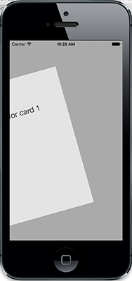
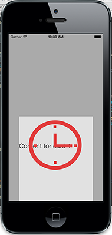

___
## Intro

KSCardView is a robust, customizable, easy to use, subclass of UIView for iOS. KSCardView has built in features for supporting moving the view in the horizontal or vertical direction and performing an action if the view is dragged past an edge of the screen.

This makes for a very simple, gesture-based UI that can be incorporated into any number of apps. Any amount of subviews can be added to it just like a standard UIView.

**Tested with iOS 6.1 and iOS 7.**

## How To Get Started

### CocoaPods
I’ve recently added [KSCardView](https://github.com/CocoaPods/Specs/tree/master/KSCardView) to the [CocoaPods](https://github.com/CocoaPods/CocoaPods) package manager repo.

CocoaPods is a tool for managing dependencies for OSX and iOS Xcode projects and provides a central repository for iOS/OSX libraries. This makes adding libraries to a project and updating them extremely easy and it will help users to resolve dependencies of the libraries they use.

- [Download KSCardView](https://github.com/drumnkyle/KSCardView/archive/master.zip) and try out the included `KSCardViewDemo` app. It is made for iPhone but will run on iPad as well.
- Read this **README**.
- Read through and run `KSCardViewDemo`, included in the source code.
- To use in your own application: 
	- Add `KSCardView.h` and `KSCardView.m` to your project.
	- Or install the CocoaPod into your project.

___


## Features

### Screenshots
<table>
<tr>
<td></td>
<td></td>
<td></td>
</tr>
<tr>
<td>Dragged Left (without overlay)</td> <td>Dragged Up</td> <td>Dragged Down</td>
</tr>
</table>

*Note: Left and Right have the same rotation animation when no overlay is specified. When an overlay is specified, they look similar to the Up and Down effect.*

### Main Features

- The card can be dragged either to the left, right, top, or bottom of the screen.
- When an edge of the card touches an edge of the screen, an animation occurs.
- When the card is dragged far enough past an edge of the screen, a delegate function is called.
- The developer can implement the delegate function to perform a specific action based on the direction to which the card left the screen.
- Built-in methods to display the card from off screen in any direction (left, right, top, or bottom).

### Demo Mode

You can utilize Demo Mode in order to display the animations of the UI without interaction. This can be used to make a help menu that explains what each gesture will do (drag left, drag right, drag up, and drag down).

*The following methods are available for assisting in making a demo mode.*

	- (void)demoUp;
	- (void)demoDown;
	- (void)demoLeft;
	- (void)demoRight;
	- (void)demoReset;
	
**Note:** *always call* `demoReset` *after calling any other demo method to reset the view before calling another demo method.*


## KSCardViewDemo

This application is meant to display some of the capabilities of KSCardView. There are 3 simple cards in this demo application. Here are the features of the application:

If the user drags the card to the...

- left edge of the screen - the next card in the stack will appear.
- right edge of the screen - the previous card in the stack will appear.
- top edge of the screen - the current card will be removed from the stack.
- bottom edge of the screen - the current card will be moved to the end of the stack.

There are custom images used as overlays to try and communicate what will happen to the card if the user drags far enough to the top or bottom edge of the screen.

**There are more customizations available (detailed below).**

## Using KSCardView

*The following code is extracted from the KSCardViewDemo project in the ```MainViewController.m``` file.*

`1. Create the frame that will be used for all instances of KSCardView.`
	
	// Create card view frame
	CGRect cardFrame = CGRectMake(35, 100, 250, 400);

`2. Create any overlay views that you would like to be displayed.`

	// Create Overlays
	NSString *upImagePath = [[NSBundle mainBundle] pathForResource:@"DeleteImage" ofType:@".png"];
    UIImage *upImage = [UIImage imageWithContentsOfFile:upImagePath];
    UIImageView *upImageView = [[UIImageView alloc] initWithImage:upImage];

`3. Set the required KSCardView properties utilized for every instance.`

	// Initialize all KSCardView instances
    [KSCardView setCardViewFrame:cardFrame];
    [KSCardView setOverlayLeft:nil right:nil up:upImageView down:downImageView];

*Note: As you can see above, you can pass nil for any argument to `setOverlayLeft:right:up:down` to not have an overlay.*

    
`4. Allocate an instance of KSCardView.`

	KSCardView *cardView = [[KSCardView alloc] init];
	// Set delegate
	cardView.delegate = self;
	// Initialize opacity to 0 if you would like the card to appear
	cardView.layer.opacity = 0.0f;
	
`5. Add card view to superview and optionally show from offscreen.`
	
	[self.view addSubview:cardView];
	[cardView showFromLeft];
	
That's it! Though, you may also want to implement the delegate methods detailed below so that your view is useful.

## KSCardViewProtocol

Whichever class you set as the delegate of each KSCardView instance should implement the KSCardViewProtocol.

`The KSCardViewProtocol contains the following methods.`

	- (void)cardDidLeaveLeftEdge:(KSCardView *)cardView;
	- (void)cardDidLeaveRightEdge:(KSCardView *)cardView;
	- (void)cardDidLeaveTopEdge:(KSCardView *)cardView;
	- (void)cardDidLeaveBottomEdge:(KSCardView *)cardView;
	
Please see the `KSCardViewDemo` project for a sample implementation of these methods.

## Configuration

There are 3 different types of configurations you can make for KSCardView.

1. Change `#define`s to adjust factors for animation properties. They are all listed in `KSCardView.h` with ample documentation.
2. Overlays can be set for all directions. If an overlay is set for a left or right, the default rotation animation does not occur.
3. Any direction can be set to be disabled for each instance of `KSCardView`.
	- Note: all directions are enabled by default.
	- You can set any direction to disabled, like so:
		```cardView.allowUp = NO;```
	- The card will then not move in that direction when dragged.

___


### More Information

- Read through the Doxygen comments in `KSCardView.h`.
	- Feel free to generate Doxygen documentation from the `KSCardView` source files.
- Read through the comments in `KSCardView.m` for more information about how it is implemented.
- If you need more help or would like to ask any questions, you can contact me.

### Credits

*KSCardView was created by Kyle Sherman.*

### License

This project is under the [MIT License (MIT)](http://opensource.org/licenses/MIT). The license is provided at the top of every source code file.

____

## Contact

- Follow me on Twitter ([@drumnkyle](https://twitter.com/drumnkyle)).

- Email me at [kyledsherman@gmail.com](mailto:kyledsherman@gmail.com).

- Check out my [Blog](http://kyle.rulostapp.com/).